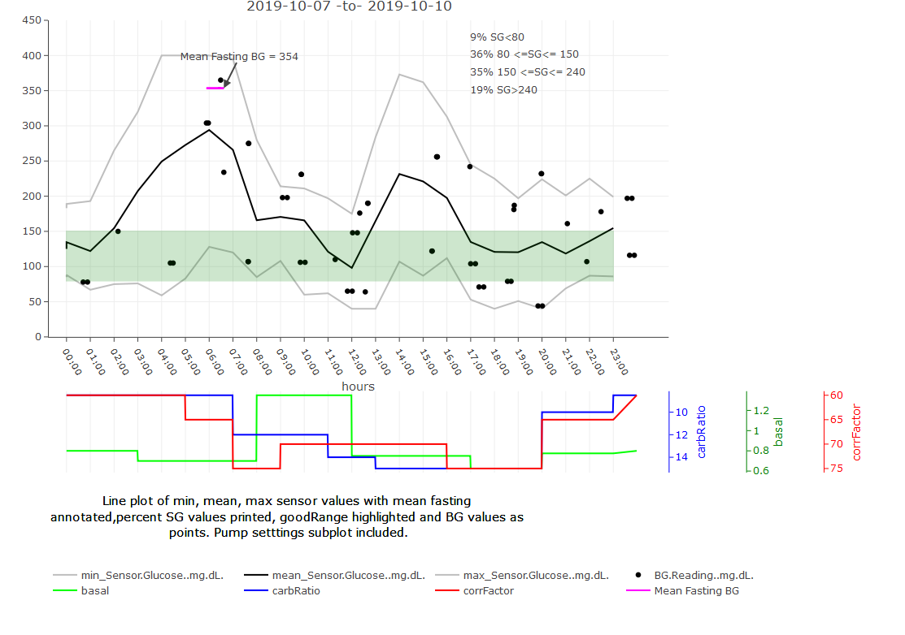
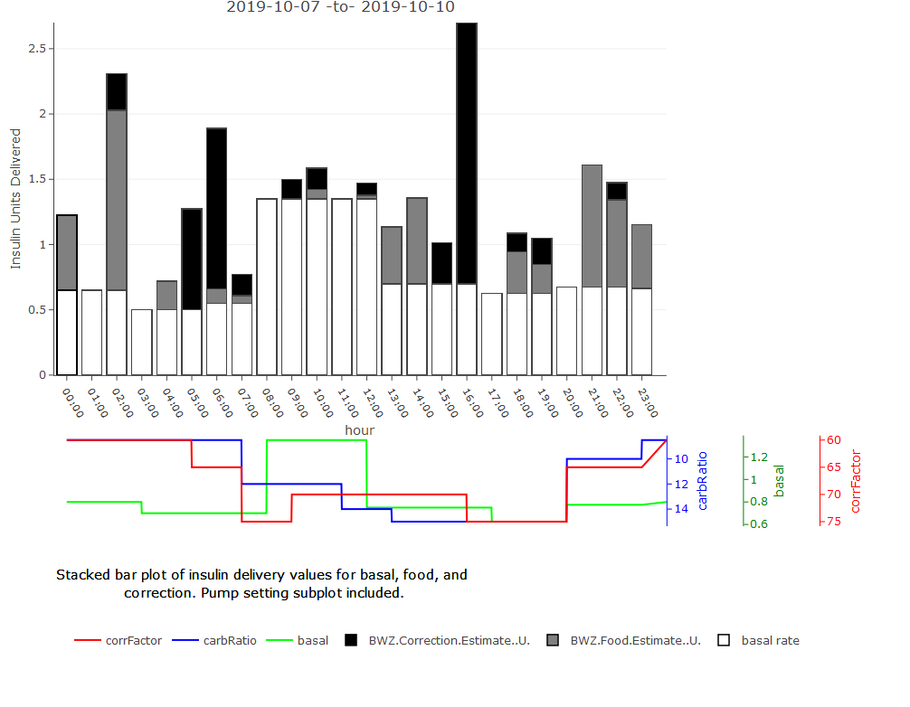
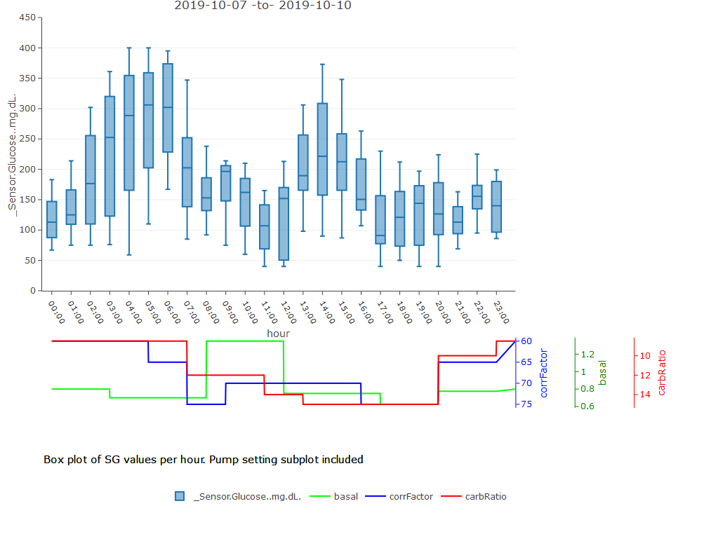
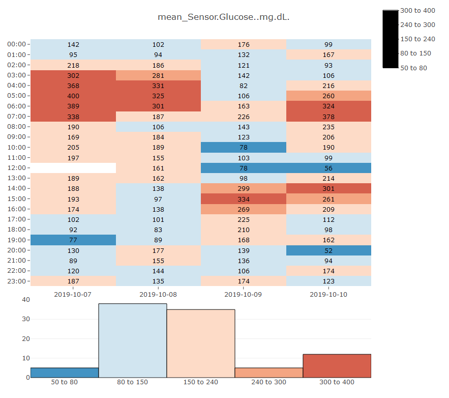

# BG.library
NO MEDICAL DECISIONS SHOULD BE MADE ON THE BASIS OF THESE RESULTS!

This is a library of functions to analyze my personal Blood Glucose data with html reports generated in Rmarkdown and a Shiny plotting App using the interactive plotting package 'plotly'.  These functions are in development stages and have not been fully tested, verified, or formally reviewed by an outside source. 

I strongly advise against making medical decisions based on analysis using these functions to analyze your BG data.

Results are not guaranteed.
## NO MEDICAL DECISIONS SHOULD BE MADE ON THE BASIS OF THESE RESULTS!

## Required R libraries
- devtools
- data.table
- lubridate
- RColorBrewer
- dplyr
- gplots
- plotly  
- knitr
- rmarkdown
- reshape2
- shinyWidgets
- shiny

## Input data and function Execution
Input data must be formatted as exampleData.csv.
Examples of function executions can be found in the csvAnalysis.R file.

Shiny app triggered using

```
libraryPath<-"./BG.library/"
path<-getwd()
fileName<-"exampleData.csv"
devtools::load_all(libraryPath,recompile = FALSE) 
shinyPlot(libraryPath, path, fileName)
```


## Help files
Function Help files are available using

```
libraryPath<-"./BG.library/"
devtools::load_all(libraryPath,recompile = FALSE) 
?breakStr #replace 'breakStr' with any function name in library
```

## Example Plots
Example plots are static in the README, but will be interactive in the program.




